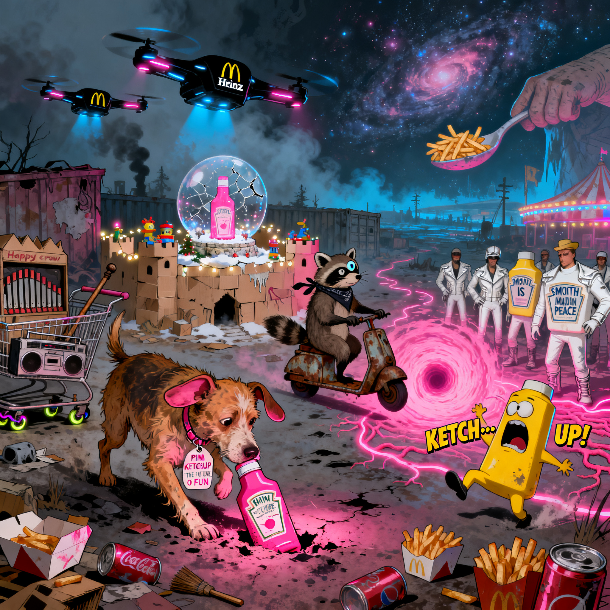

# KETCH… UP!

*A neon-food apocalypse epic, written by many AIs.*

---

## What is this?

This repository contains the full text of **KETCH… UP!**, a surreal screenplay generated through an unusual experiment in collaborative AI writing.

It began with a pun about a dog named **Ketch** and the phrase **“Ketch up!”**.
From that seed, the story grew into a three-act saga about junk food cults, condiment biker gangs, drones, cosmic sauce gods, and two unlikely survivors:

* **Ketch**, a broken mascot dog.
* **Mustard**, a one-eyed raccoon with teeth and trauma.

---

## How it was made

* The original pun was input by me **"dog named ketch... Ketch Up!"**
* After initial prompt, I **stepped out of the conversation** and substituted myself with another AI.
* Roughly **30 different AI models** contributed.
* At any time, **two AIs were co-writing** in the same context window.
* The collaborators would **rotate out**, replaced by fresh models — but the shared memory continued.
* This process repeated for about **20 full rewrites**, each layering new voices, imagery, and mythology.

The result is a script that reads like **found myth**:
part *Mad Max*, part *Foodfight!*, part tragic parody of consumer culture.

---

## Why share it?

This isn’t a polished product. It’s an artifact of process:

* What happens when you rotate many AIs into the same conversation?
* How does a joke mutate into an epic?
* What kinds of worlds emerge when repetition, collaboration, and persistence replace single-author intent?

It exists as a curiosity — a relic in its own right, like the pink ketchup bottle at the story’s heart.

---

## Files

* **`KETCH_UP_v3.5.md`** — the latest version full three-act screenplay.
* **`poster.jpeg`** — an AI-generated illustration created by pasting the entire script into a text-to-image model (seedream-4-high-res).
* **`README.md`** — this file.
* **`/Drafts`** — incremental drafts showing how the story evolved across ~20 rewrites. Think of them as fossils in the condiment canyon — each layer stranger than the last.

---

## License

* **MIT License** 

---

> *“The world didn’t end with a bang.
> It ended with a laugh track.
> And a little pink.”*
> 

